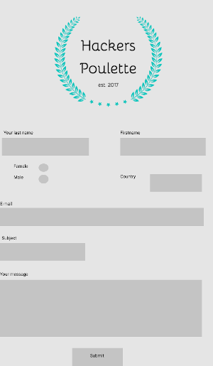

# PHP Project 
## Hackers-Poulette Form
As part of the web development training at BeCode, we have to build a form to the name of the company Hackers Poulette.   They want to allow their users to contact their support team. My mission is to develop a PHP script displaying a contact form and processing the received answer (sanitize, validate, answer the user). 
You can see the form [here](http://hackers-poulettess.herokuapp.com/index.php).

## Motivation behind this?
Exercise as part of my training at [BeCode](https://www.becode.org/) @Brussels training in Web Development. 3 Days to make this, so a dead-line to meet. I tried to make sense of servers, how PHP works, what is docker, how do you install it, what is docker compose and many other new terms. This is the first "back-end" project.

### Form Mockup

## Objectives
### Improve these
- semantical HTML
- accessibility in HTML
- methodology of progressive enhancement
- PHP programming
- project planning
- mock-up creation
- Heroku to deploy the form

## Explanation methodology

# Tools used
- Bootstrap
- Figma for the mock-up
- HTML,CSS
- PHP

# Progression
The form is a bit secure, but can certainly be improved,  
Sanitazation and validation to be improved
Any constructives comments, are welcome 👋

# Credits 
All pictures coming from [Pixabay](https://pixabay.com/fr/) (royalty-free pictures)  
October 2019  
Made in Belgium 🇧🇪

